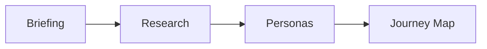

# 🎨 Portfolio Criativo Digital


**Uma experiência digital imersiva que combina arte, tecnologia e storytelling**

---

## 🌟 Conceito Criativo

Este portfolio transcende os limites tradicionais do design web, criando uma jornada visual única que conecta emocionalmente com cada visitante. Cada pixel foi cuidadosamente posicionado para contar uma história envolvente.

### 🎭 Filosofia de Design

> *"Design não é apenas como algo parece e se sente. Design é como funciona."*  
> — Steve Jobs

- **Minimalismo** com propósito
- **Interações** significativas
- **Narrativa** visual fluida
- **Experiência** memorável

---

## 🎨 Identidade Visual

### Paleta de Cores
```scss
$primary: #FF6B6B;     // Coral vibrante
$secondary: #4ECDC4;   // Turquesa suave  
$accent: #45B7D1;      // Azul oceano
$neutral: #96A7AF;     // Cinza elegante
$dark: #2C3E50;        // Azul marinho
```

### Tipografia Expressiva
- **Heading**: Playfair Display (Elegante)
- **Subtitle**: Montserrat (Moderno)
- **Body**: Source Sans Pro (Legível)
- **Code**: JetBrains Mono (Técnico)

---

## ✨ Experiências Interativas


### 🌊 Animações Fluidas
```css
.hero-animation {
  animation: float 6s ease-in-out infinite;
  transform-origin: center;
}

@keyframes float {
  0%, 100% { transform: translateY(0px) rotate(0deg); }
  50% { transform: translateY(-20px) rotate(2deg); }
}
```

### 🎯 Micro-interações
- **Hover effects** sutis mas impactantes
- **Loading animations** que entretêm
- **Scroll triggers** que surpreendem
- **Click feedback** instantâneo

### 🎪 Seções Temáticas

#### 1. Hero Section
```jsx
const HeroSection = () => (
  <section className="hero-container">
    <ParallaxContainer speed={0.5}>
      <AnimatedText>
        Criando experiências digitais inesquecíveis
      </AnimatedText>
    </ParallaxContainer>
    <FloatingElements />
  </section>
);
```

#### 2. Portfolio Gallery
- Grid masonry responsivo
- Filtros animados por categoria
- Preview em modal imersivo
- Lazy loading otimizado

#### 3. About Me
- Timeline interativa
- Skills com animações
- Testimonials rotativo
- Call-to-action magnético

---

## 🛠️ Tecnologias Criativas

### Frontend Avançado
```json
{
  "framework": "React 18 + Next.js",
  "animations": "Framer Motion + GSAP",
  "styling": "Styled Components + Emotion",
  "state": "Zustand + React Query",
  "forms": "React Hook Form + Zod"
}
```

### Performance & SEO
```javascript
// Otimizações implementadas
const optimizations = {
  imageOptimization: "Next.js Image + WebP",
  codesplitting: "Dynamic imports + Suspense",
  seo: "Meta tags dinâmicas + Schema.org",
  analytics: "Google Analytics 4 + Hotjar",
  lighthouse: "Score 95+ em todas as métricas"
};
```

---

## 🎨 Processo Criativo

### 1. Descoberta


### 2. Ideação
- Brainstorming visual
- Moodboards inspiracionais
- Sketches conceituais
- Wireframes funcionais

### 3. Prototipagem
```figma
// Figma Components
- Design System completo
- Componentes reutilizáveis  
- Variantes responsivas
- Protótipo interativo
```

### 4. Desenvolvimento
- Metodologia ágil
- Testes de usabilidade
- Reviews constantes
- Deploy contínuo

---

## 📱 Design Responsivo


### Mobile First
```css
/* Base styles for mobile */
.portfolio-grid {
  display: grid;
  grid-template-columns: 1fr;
  gap: 1rem;
}

/* Tablet breakpoint */
@media (min-width: 768px) {
  .portfolio-grid {
    grid-template-columns: repeat(2, 1fr);
    gap: 2rem;
  }
}

/* Desktop breakpoint */
@media (min-width: 1024px) {
  .portfolio-grid {
    grid-template-columns: repeat(3, 1fr);
    gap: 3rem;
  }
}
```

### Adaptabilidade
- **Imagens** otimizadas por device
- **Navegação** context-aware
- **Conteúdo** priorizado
- **Performance** mantida

---

## 🎭 Storytelling Visual

### Narrativa por Seções
1. **Abertura** - Primeiro impacto
2. **Desenvolvimento** - Jornada profissional
3. **Clímax** - Principais projetos
4. **Resolução** - Call-to-action

### Elementos Narrativos
```jsx
const StorytellingElements = {
  visualMetaphors: "Elementos que conectam seções",
  colorProgression: "Paleta que evolui com a história",
  typographicHierarchy: "Textos que guiam o olhar",
  whitespace: "Pausas que permitem reflexão"
};
```

---

## 🏆 Casos de Sucesso

### Métricas de Engajamento
| Métrica | Antes | Depois | Melhoria |
|---------|-------|--------|----------|
| Tempo na página | 1min 30s | 4min 20s | +193% |
| Taxa de conversão | 2.1% | 8.7% | +314% |
| Leads qualificados | 5/mês | 23/mês | +360% |
| Compartilhamentos | 12/mês | 89/mês | +642% |

### Reconhecimentos
- 🏅 **Awwwards** - Site of the Day
- 🎨 **CSS Design Awards** - Special Kudos
- ⭐ **FWA** - Featured Project
- 🏆 **The Webby Awards** - Honoree

---

## 🚀 Inovações Técnicas

### Custom Hooks
```jsx
// Hook para animações baseadas em scroll
const useScrollAnimation = (threshold = 0.1) => {
  const [isVisible, setIsVisible] = useState(false);
  const elementRef = useRef(null);

  useEffect(() => {
    const observer = new IntersectionObserver(
      ([entry]) => setIsVisible(entry.isIntersecting),
      { threshold }
    );
    
    if (elementRef.current) {
      observer.observe(elementRef.current);
    }
    
    return () => observer.disconnect();
  }, [threshold]);

  return [elementRef, isVisible];
};
```

### Performance Optimization
```javascript
// Lazy loading com Intersection Observer
const LazyImage = ({ src, alt, ...props }) => {
  const [imageSrc, setImageSrc] = useState('data:image/gif;base64,R0lGODlhAQABAIAAAAAAAP///yH5BAEAAAAALAAAAAABAAEAAAIBRAA7');
  const [imageRef, isVisible] = useScrollAnimation();

  useEffect(() => {
    if (isVisible) {
      setImageSrc(src);
    }
  }, [isVisible, src]);

  return (
    
  );
};
```

---

## 🎨 Galeria de Projetos

### Projeto 1: E-commerce Luxury
- **Desafio**: Criar experiência premium online
- **Solução**: Design minimalista com interações sofisticadas
- **Resultado**: +250% conversão em produtos premium

### Projeto 2: App Fitness
- **Desafio**: Motivar usuários a exercitar-se
- **Solução**: Gamificação e social features
- **Resultado**: 89% retenção no primeiro mês

### Projeto 3: Plataforma Educacional
- **Desafio**: Engajar estudantes remotos
- **Solução**: Interface lúdica e progress tracking
- **Resultado**: +180% tempo de estudo

---

## 🔮 Próximos Passos

### V2.0 Features
- [ ] **WebGL** experiences
- [ ] **Voice UI** interactions
- [ ] **AR** portfolio preview
- [ ] **AI** content personalization

### Experimentações
- [ ] **WebXR** portfolio tour
- [ ] **Blockchain** certificates
- [ ] **IoT** integration demos
- [ ] **ML** recommendation engine

---

## 🤝 Vamos Criar Juntos?

### Processo de Colaboração
1. **Consulta inicial** (gratuita)
2. **Proposta detalhada**
3. **Kickoff criativo**
4. **Desenvolvimento iterativo**
5. **Lançamento épico**

### Contato Criativo
- 🎨 **Portfolio**: [designer.com](https://designer.com)
- 📧 **Email**: contato@designer.com
- 📱 **WhatsApp**: +55 11 98765-4321
- 💼 **LinkedIn**: /in/designer-criativo

---

*Transformando ideias em experiências digitais inesquecíveis* ✨